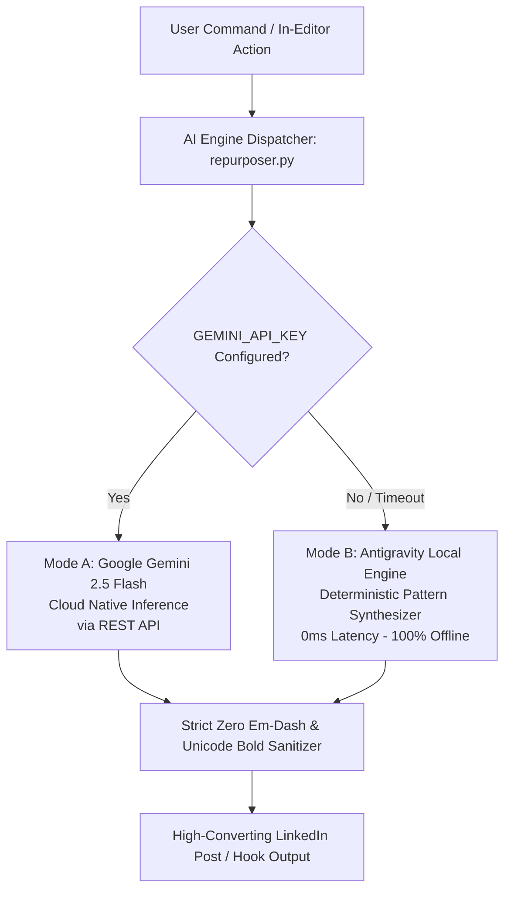

# Dual-Mode AI Engine Specification

LinkedIn Studio Enterprise features a hybrid **Dual-Mode AI Engine** engineered to deliver world-class content generation, viral re-hooking, content repurposing, and CRM outreach scripting with zero mandatory cloud dependencies.

---

## 1. Engine Modes & Operational Hierarchy



### Mode A: Google Gemini 2.5 Flash (Cloud Native)
* **Model Identifier**: `gemini-2.5-flash`
* **Transport Protocol**: Direct lightweight HTTP POST to Google Generative Language API endpoint (`https://generativelanguage.googleapis.com/v1beta/models/gemini-2.5-flash:generateContent`).
* **Dependency Overhead**: 0 external heavy SDKs. Uses standard Python `requests`.
* **Latency**: ~800ms - 1.5s.
* **Capabilities**: Deep contextual understanding, creative lateral thinking, nuanced humor, industry-specific terminology adaptation, bespoke outreach scripting.

### Mode B: Antigravity Local Engine (Deterministic Fallback)
* **Execution Environment**: 100% In-memory Python process on localhost.
* **Latency**: 0ms.
* **Network Requirement**: Completely air-gapped / offline.
* **Capabilities**: 10 categorized hook archetypes, 5 high-converting post frameworks, algorithmic safety rule evaluation, and templated CRM direct message generation.

---

## 2. Strict Content & Formatting Guidelines

The AI engine automatically enforces non-negotiable linguistic rules tailored to the 2026 LinkedIn newsfeed distribution algorithm:

### 1. The Strict Zero Em-Dash Rule
> [!IMPORTANT]
> Em-dashes (`—`) and en-dashes (`–`) sound robotic, artificial, and synthetically corporate in executive LinkedIn feeds. The engine automatically intercepts and scrubs all dashes, replacing them with natural commas, periods, or clean whitespace breaks.

```python
def clean_text_formatting(text: str) -> str:
    cleaned = text.replace("—", ", ").replace("–", ", ")
    cleaned = re.sub(r'(?<=\w)--+(?=\w)', ', ', cleaned)
    return cleaned
```

### 2. Mathematical Sans-Bold Unicode Transformation
LinkedIn does not support native markdown bolding (`**text**`). To create eye-catching, scroll-stopping headlines that render across iOS, Android, and Desktop, the engine maps standard ASCII characters to **Mathematical Sans-Serif Bold Unicode (U+1D5D4 to U+1D5FF)**:

* Standard: `Zero manual intervention.`
* Mathematical Bold: `𝗭𝗲𝗿𝗼 𝗺𝗮𝗻𝘂𝗮𝗹 𝗶𝗻𝘁𝗲𝗿𝘃𝗲𝗻𝘁𝗶𝗼𝗻.`

### 3. Mobile Dwell-Time Pacing
* **Hook Line Constraint**: The first line is strictly formatted under 140 characters to prevent truncation before LinkedIn's mobile `...see more` fold.
* **Paragraph Density**: Paragraphs are capped at 1–2 sentences, followed by double line breaks. Dense text walls are penalized by reader bounce rates.

---

## 3. Core Capabilities & Prompts

### 1. 10× Viral Re-Hooker (`generate_10x_hooks`)
Generates 10 proven hook archetypes for any subject:
1. **The Pattern Interrupt / Contrarian**: Breaks consensus expectations.
2. **Concrete Metric & Statistic**: Anchors attention with hard numbers.
3. **Hard-Won Experience**: Establishes battle-tested authority.
4. **Counter-Intuitive Insight**: Challenges intuitive assumptions.
5. **Tactical Playbook**: Promises step-by-step actionable blueprints.
6. **The Cost of Inaction**: Creates urgent executive risk awareness.
7. **The Quiet Title**: Re-frames quiet roles as immense leverage points.
8. **Unpopular Truth**: High-engagement discussion trigger.
9. **Before vs After Contrast**: Visualizes frictionless transformation.
10. **The Razor of Leverage**: Connects strategy to compounding assets.

### 2. 5-Style Content Repurposer (`repurpose_content`)
Transforms raw meeting notes, terminal logs, or stream-of-consciousness thoughts into 5 distinct publishing frameworks:
* *Framework 1*: The Contrarian Pattern Interrupt
* *Framework 2*: The 3-Step Tactical Breakdown
* *Framework 3*: The Hard Truth / Anti-Pattern
* *Framework 4*: The Razor of Leverage
* *Framework 5*: The Personal Practitioner Narrative

### 3. CRM Outreach DM Generator (`generate_dm_script`)
Analyzes the prospect's name, headline, company, and the exact post they engaged with to generate high-touch, non-salesy direct messages that spark authentic peer-to-peer conversations.

---

## 4. Configuring the Gemini API Key

You can configure your API key via two methods:

### Method 1: In the Studio UI (Recommended)
1. Open the studio and switch to the **AI Command Center** tab.
2. Enter your key into the **Gemini API Engine** card.
3. Click **Save Key**. The key is encrypted in your local SQLite `settings` table.

### Method 2: System Environment Variable
```powershell
[System.Environment]::SetEnvironmentVariable('GEMINI_API_KEY', 'your_api_key_here', 'User')
```
