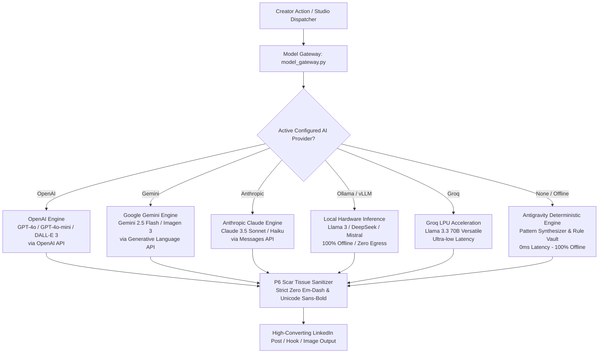

# Bring-Your-Own-AI (BYO-AI) & Multi-Model Engine Specification

LinkedIn Studio Enterprise features a pluggable **Bring-Your-Own-AI (BYO-AI)** multi-model architecture. The platform does not mandate or restrict creators to any single proprietary vendor (such as Google Gemini). Creators have complete autonomy to configure and hot-swap between industry-leading cloud LLMs, local offline models, or the zero-egress local deterministic engine.

---

## 1. Engine Modes & Operational Hierarchy



---

## 2. Supported AI Providers & Models

| Provider Key | Provider Name | Default Model | Supported Models | Image Support | Key Required |
| :--- | :--- | :--- | :--- | :--- | :--- |
| `openai` | OpenAI | `gpt-4o` | `gpt-4o`, `gpt-4o-mini`, `o3-mini` | DALL-E 3 (`dall-e-3`) | Yes |
| `gemini` | Google Gemini | `gemini-2.5-flash` | `gemini-2.5-flash`, `gemini-2.0-flash`, `gemini-1.5-pro` | Imagen 3 (`imagen-3.0-generate-002`) | Yes |
| `anthropic` | Anthropic Claude | `claude-3-5-sonnet-20241022` | `claude-3-5-sonnet`, `claude-3-5-haiku`, `claude-3-opus` | No (Pollinations fallback) | Yes |
| `ollama` | Ollama Local LLM | `llama3:latest` | `llama3`, `mistral`, `deepseek-r1`, `qwen2.5` | No (Local canvas fallback) | No |
| `groq` | Groq LPU | `llama-3.3-70b-versatile` | `llama-3.3-70b-versatile`, `llama-3.1-8b-instant` | No (Pollinations fallback) | Yes |
| `custom_openai` | Custom OpenAI Endpoint | `default` | Any model hosted on vLLM, LocalAI, or OpenRouter | No (Pollinations fallback) | Optional |
| `local_deterministic` | Antigravity Local Engine | `deterministic-heuristics-v2` | Categorized viral patterns and heuristics | Local Canvas Generator | No |

---

## 3. Active Verification Gate & CLI Tooling

A core architectural principle of Inox Hydra is the **Active Verification Ping**:
The platform will **NEVER** save broken credentials or an unreachable endpoint to SQLite. When you configure an AI provider via the CLI or API, a lightweight live test prompt is sent to verify that the credentials and network connection succeed.

If verification succeeds, the latency is measured, recorded, and the configuration is saved. If verification fails (e.g., HTTP 401 Unauthorized, HTTP 404, or network timeout), the configuration is rejected with a descriptive error message and the previous working configuration remains active.

### CLI Commands

```bash
# List all available AI providers and default models
python studio_cli.py ai list-providers

# Configure an AI provider (interactive prompt or non-interactive flags)
python studio_cli.py ai configure --provider openai --api-key "sk-..." --model gpt-4o
python studio_cli.py ai configure --provider gemini --api-key "AIzaSy..." --model gemini-2.5-flash
python studio_cli.py ai configure --provider anthropic --api-key "sk-ant-..." --model claude-3-5-sonnet-20241022
python studio_cli.py ai configure --provider ollama --model llama3:latest

# Display currently active provider, model, masked key, and status
python studio_cli.py ai status

# Run live latency ping test on the active provider
python studio_cli.py ai test

# Reset configuration to 100% offline local deterministic engine
python studio_cli.py ai reset
```

---

## 4. Strict Linguistic & Formatting Standards (P6 Scar Tissue)

Regardless of which AI model you configure, every generation passes through the deterministic P6 scar tissue sanitization filter:

### 1. The Strict Zero Em-Dash Rule
> [!IMPORTANT]
> Em-dashes (` - `) and en-dashes (`–`) make LinkedIn posts sound robotic, artificial, and corporate. The sanitization layer intercepts and strips all dashes, replacing them with natural commas, periods, or clean line breaks.

### 2. Mathematical Sans-Bold Unicode Transformation
LinkedIn does not render native markdown bolding (`**text**`). To create eye-catching headlines that render across iOS, Android, and Desktop feeds, the engine maps standard ASCII characters to **Mathematical Sans-Serif Bold Unicode (U+1D5D4 to U+1D5FF)**:
* Standard: `Zero manual intervention.`
* Mathematical Bold: `𝗭𝗲𝗿𝗼 𝗺𝗮𝗻𝘂𝗮𝗹 𝗶𝗻𝘁𝗲𝗿𝘃𝗲𝗻𝘁𝗶𝗼𝗻.`

### 3. Mobile Dwell-Time Pacing
* **Pre-Fold Hook**: Opening line is formatted strictly under 140 characters to avoid truncation before the `...see more` fold.
* **Paragraph Density**: Paced at 1-2 sentences with double line breaks to maximize mobile dwell time.

---

## 5. REST API Endpoints

* `GET /api/ai/config`: Retrieves active provider, model, masked key, base URL, and supported providers list.
* `POST /api/ai/configure`: Submits candidate configuration for active verification and persistence.
* `GET /api/ai/status`: High-level operational status, active mode, and BYO-AI capabilities.
* `POST /api/ai/command`: High-level prompt execution through the active provider.
* `POST /api/format/re-hook`: 10x viral hook generator.
* `POST /api/format/repurpose`: 5-style content repurposer.
