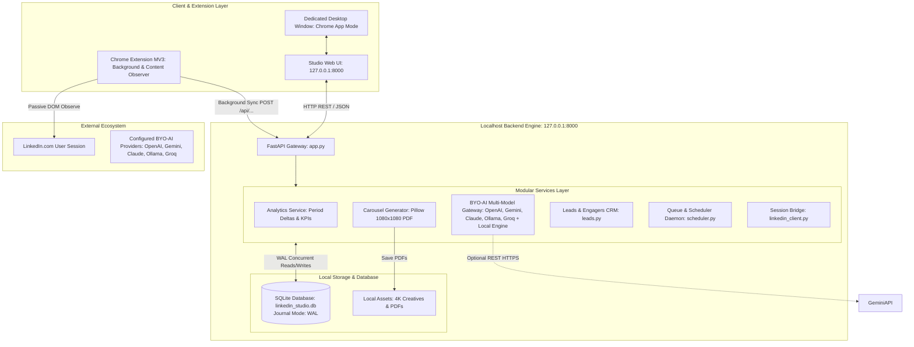
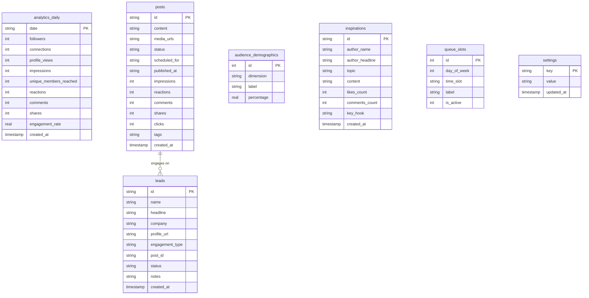

# Technical Architecture & Security Blueprint

This document details the software architecture, storage model, concurrency management, and zero-egress security design of **LinkedIn Studio Enterprise**.

---

## 1. High-Level Architecture Diagram



---

## 2. Storage Model & Concurrency Management

### SQLite Write-Ahead Logging (WAL) Mode
All platform data is persisted in a single local SQLite database:
`studio/data/linkedin_studio.db`

To ensure real-time responsiveness while background ingestion tasks (such as periodic analytics sync or commenter scraping) write to the database, SQLite is initialized with **WAL mode**:

```python
def get_db():
    conn = sqlite3.connect(DB_PATH)
    conn.row_factory = sqlite3.Row
    conn.execute("PRAGMA journal_mode = WAL;")
    conn.execute("PRAGMA synchronous = NORMAL;")
    return conn
```

### Why WAL Mode is Critical:
1. **Zero Read Blocking**: Multiple read operations (e.g. browsing the Analytics tab or scrolling through CRM leads) execute concurrently without waiting for ongoing background write locks.
2. **Crash Resilience**: State transitions are atomic and recorded in the `-wal` file before checkpointing to the main database file.
3. **Low Latency**: Queries typically execute in under 1 millisecond on NVMe drives.

---

## 3. Database Schema & Data Dictionary

The database consists of 7 normalized relational tables:



---

## 4. Security Model & Zero-Egress Guarantee

### Threat Model & Safeguards

| Threat Vector | Commercial SaaS (e.g. Taplio) | Our Local Architecture |
| :--- | :--- | :--- |
| **Draft Confidentiality** | Drafts sent to third-party cloud servers | Stored exclusively on local disk (`linkedin_studio.db`) |
| **Account Ban Risk** | Automated cloud bots spoofing IPs trigger security checkpoints | Zero automated bot activity. Uses your own authenticated browser cookies |
| **Data Leakage / Telemetry** | Mixpanel, Segment, and Google Analytics tracking | 0 tracking pixels, 0 telemetry pings, 0 external CSS/JS dependencies (Chart.js cached/CDN) |
| **Credential Egress** | Cookie/password sent to third-party SaaS databases | Cookies remain on `127.0.0.1`. Never leave localhost |
| **Network Attack Surface** | Public web endpoints exposed to internet | Backend binds exclusively to loopback interface (`127.0.0.1`). Not accessible from LAN or WAN |

---

## 5. Threading & Process Model

1. **Uvicorn Daemon**: Runs the ASGI FastAPI application asynchronously on `127.0.0.1:8000`.
2. **Scheduler Worker Thread**: Spawns at FastAPI startup (`on_startup`) via `studio/backend/scheduler.py`. Polls the `posts` table every 60 seconds for drafts where `status = 'scheduled'` and `scheduled_for <= UTC_NOW()`.
3. **Chrome Process**: Runs in isolated `--app` container, sandboxed by Windows OS user privileges.
