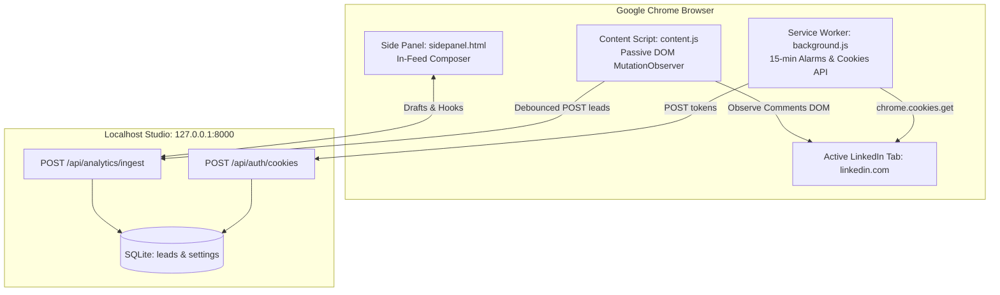

# Chrome Extension & Zero-Detection Sync Bridge

The **LinkedIn Studio Chrome Extension (v2.5)** serves as a private, undetectable bridge between your authenticated LinkedIn session and the local studio running on `127.0.0.1:8000`.

---

## 1. Extension Component Architecture

---

## 2. Anti-Detection & Account Safety Principles

Most commercial scrapers get banned because they inject invasive code or send high-frequency synthetic requests. LinkedIn uses advanced client-side bot detection scripts that analyze:
1. `Function.prototype.toString` inspection to check if `window.fetch` or `XMLHttpRequest` has been monkey-patched.
2. Inconsistent browser fingerprinting and non-human mouse/scroll velocity.
3. Automated API requests originating from datacenter IP addresses.

### How LinkedIn Studio Achieves Zero-Detection:

| Vulnerability Vector | Commercial Extensions | LinkedIn Studio Architecture |
| :--- | :--- | :--- |
| **Fetch Monkey-Patching** | Wraps `window.fetch` to intercept headers, tripping bot traps | **Zero prototype modification**. Never alters global browser objects |
| **Request Origin** | Cloud servers query LinkedIn Voyager API with fake user-agents | **0 cloud requests**. Only your real browser session communicates with LinkedIn |
| **DOM Scraping** | Executes aggressive automated scrolling and clicking scripts | **Passive Observation**. Listens to natural user scrolling via `MutationObserver` |
| **Session Capture** | Prompts user for email and password | **Cookie API Isolation**. Reads `li_at` and `JSESSIONID` through secure `chrome.cookies` |

---

## 3. Passive Commenter & Engager Capture Pipeline

When you browse LinkedIn and view comments or open the reaction modal (Likes/Celebrates) of any post, `content.js` passively observes DOM mutations:

* **Comment Extraction**: Observes comments in feed updates and permalink post views, parsing person names, headlines, profile URLs, and exact comment text.
* **Reaction Modal Extraction**: When you click the reaction count on any post to see who liked/celebrated it, the extension captures all listed reactors into your CRM pipeline as warm engagers.
* **Smart Deduplication**: Re-engaging prospects have their latest context notes updated in SQLite rather than creating duplicate entries.
* **In-Page Feedback**: Displays a subtle toast on LinkedIn when new engagers are ingested (`⚡ LinkedIn Studio CRM: Ingested X warm engagers!`).

### Lead Extraction Fields:
* **Name**: Sanitized author name.
* **Headline**: Current professional designation (e.g. `VP of Engineering at CloudScale`).
* **Company**: Extracted from headline via regex parsing (`at X` / `@ X`).
* **Profile URL**: Cleaned LinkedIn vanity URL (tracking parameters stripped).
* **Engagement Type**: Categorized as `Commented`, `Liked`, or `Reposted`.
* **Notes**: Quoted comment text or reaction context for personalized 1-on-1 outreach.

---

## 4. Background Periodic Token Synchronization

In `studio/extension/background.js`, a Chrome Alarm runs periodically (every 15 minutes) and upon browser startup:

1. Queries Chrome's cookie store for:
   * `li_at` (LinkedIn authentication token)
   * `JSESSIONID` (LinkedIn CSRF protection token)
2. Posts tokens to `http://127.0.0.1:8000/api/auth/cookies`.
3. The local backend verifies the token by making a single lightweight call to `/voyager/api/me` to fetch your authentic creator name, headline, and profile identifier.
4. Saves session state to SQLite `settings` table with status `ready`.

---

## 5. Sidepanel Composer & In-Feed Warm CRM

The extension embeds a lightweight workspace directly into Chrome's native **Side Panel**:
* **Composer Tab**: Draft and format posts with Unicode mathematical sans-bold and insert directly into the LinkedIn composer with 1 click.
* **Queued Posts Tab**: Review your upcoming scheduled publishing queue.
* **Warm CRM Tab**: Browse your active prospect pipeline right alongside LinkedIn. Click **⚡ Copy DM** to generate a personalized outreach message tailored to the prospect's real comments and copy it to your clipboard with one click.

