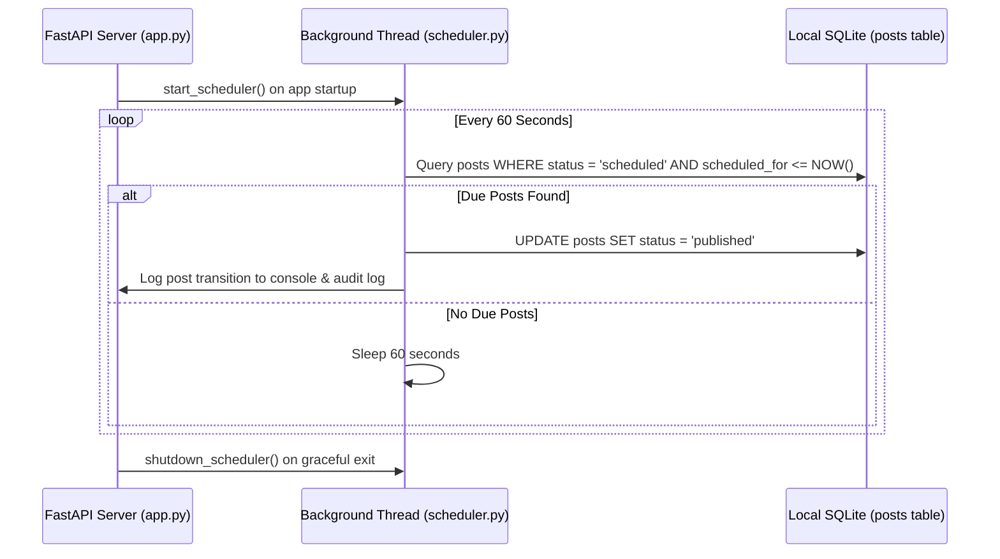

# Module 02: Schedule & Queue Enterprise Manual

The **Schedule & Queue** module manages publishing cadence, optimal time windows, and local background post dispatching for LinkedIn Studio Enterprise.

---

## 1. Cadence Strategy & Peak Distribution Windows

Consistent publishing is the single greatest multiplier of creator algorithmic reach. However, posting erratically or double-posting within a short window resets engagement velocity and cannibalizes impressions.

### Golden Cadence Rules for 2026:
1. **Minimum 12-Hour Cooldown**: LinkedIn evaluates post performance over a 24-hour cycle. Publishing a new post within 12 hours of your previous post cuts off organic distribution of the earlier content.
2. **Optimal Weekly Frequency**: 3 to 5 high-signal posts per week outperforms daily low-effort posting.
3. **Smart Engagement Slots**:
   * **Morning Window (08:30 AM Local Time)**: Reaches executive leaders during the morning commute and pre-work briefing routine.
   * **Evening Window (05:30 PM Local Time)**: Captures professionals during wrap-up, transition hours, and post-work reflection.

---

## 2. Queue Interface & Visual Architecture

Accessed via the sidebar (**Schedule & Queue**, `#tab-queue`), the view consists of:

```
+-------------------------------------------------------------------------------------------------------+
| PANEL HEADER: Publishing Cadence & Smart Slots  |  [Sync Queue Button]                                |
| Subtitle: Optimized for maximum creator dwell time and organic feed distribution                      |
+-------------------------------------------------------------------------------------------------------+
| SCHEDULED POST CARDS LIST (#queue-cards-list)                                                         |
|                                                                                                       |
| +--- Post Card: post-enterprise-scheduled ----------------------------------------------------------+ |
| | [Status Pill: SCHEDULED]  |  Scheduled for: 2026-09-15 17:30:00 (Today at 5:30 PM)                | |
| | Post Content Snippet:                                                                             | |
| | "Stepping into enterprise architecture and modern systems requires discipline..."                 | |
| |                                                                                                   | |
| | Controls:                                                                                         | |
| | [📅 Reschedule Datetime Picker]   [Update Time Button]   [🗑 Cancel & Delete Button]               | |
| +---------------------------------------------------------------------------------------------------+ |
|                                                                                                       |
| +--- Smart Slots Overview Grid ---------------------------------------------------------------------+ |
| | Slot 1: Monday    08:30 AM  [Recommended - Executive Focus]                                       | |
| | Slot 2: Tuesday   05:30 PM  [Recommended - System Architecture]                                   | |
| | Slot 3: Wednesday 08:30 AM  [Recommended - Deep Dive Breakdown]                                   | |
| | Slot 4: Thursday  05:30 PM  [Recommended - Contrarian Insight]                                    | |
| | Slot 5: Friday    08:30 AM  [Recommended - Weekly Retrospective]                                  | |
| +---------------------------------------------------------------------------------------------------+ |
+-------------------------------------------------------------------------------------------------------+
```

---

## 3. UI Controls & Operations

### 1. `Sync Queue` Button
* Triggers a live fetch against `GET /api/posts?status=scheduled` and updates the queue list in real time.
* Refreshes the top-level queue count badge in the sidebar navigation (`#queue-badge-count`).

### 2. Rescheduling a Post
* Every scheduled post card displays an interactive HTML5 datetime-local input field.
* Changing the timestamp and clicking **Update Time** executes:
  ```http
  POST /api/posts/{post_id}/reschedule
  Content-Type: application/json

  {
    "scheduled_for": "2026-09-16 08:30:00"
  }
  ```
* Updates the post timestamp in SQLite and confirms with a local toast message.

### 3. Canceling / Deleting a Scheduled Post
* Clicking the trash icon (`🗑`) calls `DELETE /api/posts/{post_id}`.
* Removes the post from the queue and releases the scheduled slot.

---

## 4. Local Background Scheduler Daemon (`scheduler.py`)

LinkedIn Studio does not rely on third-party cloud webhooks or external servers to manage the publishing queue. Scheduling is managed by an in-process daemon initialized on FastAPI startup:



### Safety & Resilience
* **Crash Proof**: If the application is closed during a scheduled time, the next time the studio launches, the scheduler immediately identifies missed timestamps and processes them safely.
* **Zero Outbound Leaks**: All post state transitions remain on `127.0.0.1`.
