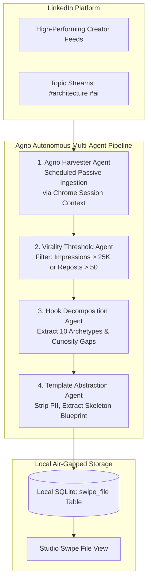

# Module 04: Viral Swipe File & Agno Framework Inbound Roadmap

The **Viral Swipe File** module provides a high-signal repository of reverse-engineered viral post structures, proven hook formulas, and pacing frameworks from top industry practitioners.

---

## 1. Visual Layout & User Interface

Accessed via the sidebar (**Viral Swipe File**, `#tab-inspirations`), the interface provides instant filtering across 356 permanently vaulted blueprints:

```
+-------------------------------------------------------------------------------------------------------+
| PANEL HEADER: Viral Post Swipe File  |  [Badge: 356 Vaulted Blueprints]                               |
| Subtitle: Reverse-engineered viral hooks, structures, and pacing vaulted permanently from top creators|
| Search Bar: [🔍 Search 356 posts by keyword, author, or topic...                                  ] |
+-------------------------------------------------------------------------------------------------------+
| 13 TOPIC CATEGORY FILTER CHIPS (#insp-topic-chips)                                                   |
| [All (356)]  [🤖 AI Agents (25)]  [🏛️ Architecture (25)]  [📡 Observability (23)]  [⚙️ Systems (23)]   |
| [💼 B2B SaaS (26)]  [👑 Leadership (28)]  [✍️ Content (28)]  [📈 Growth (28)]  [🚀 Solopreneur (28)]    |
| [💻 CTO (29)]  [⚡ Productivity (29)]  [🎯 Consulting (30)]                                            |
+-------------------------------------------------------------------------------------------------------+
| SWIPE FILE GRID (#inspirations-container)                                                             |
|                                                                                                       |
| +--- Blueprint Card -------------------------+  +--- Blueprint Card -------------------------+        |
| | Topic: AI Agents          Author: Eric B.  |  | Topic: Systems Engineering  Author: Dan K.  |        |
| | "I hired an AI PM.                         |  | "EBITDA is an unreliable proxy for spend-  |        |
| | Didn't look at her resume once.            |  | able cash in boutique consulting M&A..."   |        |
| | Here's what I looked at instead..."        |  |                                            |        |
| |                                            |  | [⚡ Inject into Studio]  [📋 Copy Blueprint] |        |
| | [⚡ Inject into Studio]  [📋 Copy Blueprint] |  +--------------------------------------------+        |
| +--------------------------------------------+                                                        |
+-------------------------------------------------------------------------------------------------------+
```

---

## 2. Current Architecture & Accumulation Method

### How Posts Are Accumulated Today:
* **Curated Offline Vault**: The 356 blueprints are currently stored locally in `studio/data/taplio_vault_archive_backup.json` and mirrored in the local SQLite database.
* **100% Air-Gapped & Offline**: Unlike cloud tools that query remote APIs on every keystroke, the entire database is loaded into local memory upon startup, ensuring zero latency and zero external network calls.
* **13 Specialized Topic Taxonomies**:
  1. **AI Agents (25 posts)**: Practical implementation stories, LLM orchestration patterns, evals, and agent workflows.
  2. **Enterprise Architecture (25 posts)**: Decoupling monoliths, event-driven designs, and bounded contexts.
  3. **Observability (23 posts)**: Distributed tracing, telemetry metrics, and MTTR reduction narratives.
  4. **Systems Engineering (23 posts)**: Zero-downtime migrations, database scaling, and state machine designs.
  5. **B2B SaaS (26 posts)**: Positioning, ARR growth frameworks, and outbound strategy.
  6. **Leadership (28 posts)**: Team empowerment, culture building, and hiring playbooks.
  7. **Content Strategy (28 posts)**: Hook formulas, dwell-time pacing, and audience growth mechanics.
  8. **Growth (28 posts)**: Funnel optimization, creator monetization, and distribution loops.
  9. **Solopreneur (28 posts)**: High-leverage workflows, automation, and boutique consulting.
  10. **CTO (29 posts)**: Technical debt management, executive communication, and vendor evaluations.
  11. **Productivity (29 posts)**: Deep work systems, calendar audits, and asynchronous operations.
  12. **Consulting (30 posts)**: Retainer packaging, advisory pricing, and client discovery.

### Interactivity & Authoring Controls:
* **`⚡ Inject into Studio`**: Copies the blueprint directly into the Studio Editor, allowing you to substitute your own metrics and case studies into a proven narrative skeleton.
* **`📋 Copy Blueprint`**: Copies the full post text to your clipboard.

---

## 3. Current Limitation: Absence of a Live Crawling Engine

Currently, the swipe file relies on historical vault snapshots and offline curated datasets. The local application does not yet include an automated, dynamic scraper or real-time feed-monitoring daemon running on localhost.

---

## 4. Strategic Architecture Plan: Agno Framework Autonomous Inbound Engine

To automate the continuous accumulation of outlier, viral LinkedIn posts, we are designing an automated inbounding pipeline built on the **Agno Framework** (formerly Phidata / Agno agentic framework).

### Proposed Agno Multi-Agent Pipeline Architecture:



### Key Components of the Planned Agno Pipeline:

1. **Agno Harvester Agent**:
   * Uses an authenticated local browser context (leveraging the existing Chrome Extension session cookies `li_at` and `JSESSIONID`).
   * Runs non-invasive, passive batch polling at scheduled intervals (e.g. daily at 2:00 AM) to avoid triggering LinkedIn bot detection.
2. **Virality & Outlier Gatekeeper Agent**:
   * Analyzes engagement velocity (comments-to-reactions ratio, repost velocity).
   * Discards low-engagement or generic updates, passing only statistically significant outliers (top 1% engagement).
3. **Hook Archetype Classifier Agent**:
   * Automatically inspects the first 140 characters of each post.
   * Labels the post with its underlying hook structure (Contrarian, Concrete Metric, Hard-Won Lesson, Tactical Playbook, etc.).
4. **Template Abstraction Agent**:
   * Strips out company-specific names and private identifiers.
   * Produces a fill-in-the-blank blueprint ready to be injected into the Studio Editor with 1 click.
5. **Direct Persistence into Local SQLite**:
   * Ingests new records directly into the local `swipe_file` table in SQLite, instantly expanding the studio's vaulted collection.
