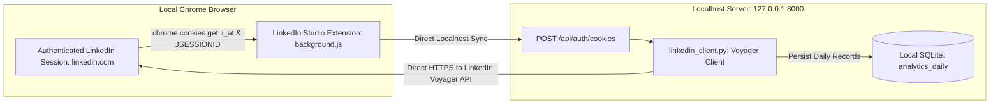

# Module 05: Creator Analytics & LinkedIn Connection Engine Manual

The **Analytics** module provides an executive-grade telemetry dashboard for tracking reach, dwell velocity, and audience demographics. All metrics originate directly from the creator's authenticated LinkedIn connection and are stored privately on `127.0.0.1`.

---

## 1. Direct LinkedIn Account Connection Architecture

### Zero-Cloud, Direct Local Ingestion
Unlike commercial SaaS creator suites that require you to enter your LinkedIn password or route requests through remote third-party cloud servers (introducing account ban risks and data security leaks), **LinkedIn Studio Enterprise pulls analytics directly from your local browser's authenticated LinkedIn session**:



### How the Connection Operates:
1. **Cookie Session Bridge**: The local Chrome Extension safely extracts the `li_at` authentication cookie and `JSESSIONID` CSRF token from your active `linkedin.com` tab.
2. **Local Token Handshake**: Tokens are sent via HTTP POST to `http://127.0.0.1:8000/api/auth/cookies`.
3. **Direct Local Voyager Calls**: The local Python backend (`linkedin_client.py`) communicates directly with LinkedIn's internal Voyager endpoints (`/voyager/api/identity/profiles/me` and `/voyager/api/creator/analytics`) from your local IP address.
4. **Permanent Local History**: Data is written directly to the `analytics_daily` table in SQLite, preserving historical records indefinitely (bypassing LinkedIn's native 365-day reporting expiration).

---

## 2. Analytics Visual Architecture & Layout Overview

Accessed via the sidebar (**Analytics**, `#tab-analytics`), the dashboard presents 3 analytical panels:

```
+-------------------------------------------------------------------------------------------------------+
| 1. KPI VELOCITY ROW                                                                                   |
| [Followers: 2,412]        [Connections: 2,347]        [Profile Views: 104]       [Total Impr: 314]    |
| +103 past 30 days         Active Network              +18% vs prev period        Active Cadence       |
+-------------------------------------------------------------------------------------------------------+
| 2. TIME-SERIES VISUALIZATION PANEL                                                                    |
| Title: Audience Reach & Dwell Velocity  |  Subtitle: Daily impressions time-series data               |
| Action: [Export CSV Button]                                                                           |
|                                                                                                       |
| +--- Chart.js Interactive Canvas (#analytics-chart-canvas) -----------------------------------------+ |
| |                                                                                                   | |
| |   3K |                 /\                                                                         | |
| |   2K |      /\        /  \     /\                                                                 | |
| |   1K |     /  \  /\  /    \   /  \                                                                | |
| |    0 +----+----+----+------+----+---------------------------------------------------------------+ |
| |       Aug 15       Aug 25        Sep 05       Sep 15                                              | |
| +---------------------------------------------------------------------------------------------------+ |
+-------------------------------------------------------------------------------------------------------+
| 3. AUDIENCE DEMOGRAPHICS BREAKDOWN                                                                    |
| [Top Job Titles]                 [Top Companies]                    [Top Geographies]                 |
| • Software Engineers (28%)       • Amazon Web Services (12%)        • San Francisco Bay Area (34%)    |
| • Systems Architects (22%)       • Microsoft (9%)                   • New York Metro (18%)            |
| • Engineering Leaders (19%)      • Google (8%)                      • London, UK (14%)                |
| • CTOs / Founders (15%)          • Stripe (6%)                      • Bengaluru, India (12%)          |
+-------------------------------------------------------------------------------------------------------+
```

---

## 3. High-Level KPI Calculations & Growth Deltas

The dashboard computes exact period-over-period percentage deltas across 4 core creator horizons: **7D**, **14D**, **30D**, and **90D**.

### Delta Formula:
$$\text{Growth Delta \%} = \left(\frac{\text{Current Period Sum} - \text{Preceding Period Sum}}{\text{Preceding Period Sum}}\right) \times 100$$

### Tracked Metrics:
1. **Followers (`#kpi-followers`)**: Total followers accrued, with exact net additions over the active horizon.
2. **Connections (`#kpi-connections`)**: 1st-degree mutual network connections.
3. **Profile Views (`#kpi-views`)**: Frequency of member visits to your LinkedIn profile. A primary leading indicator of executive inbound interest.
4. **Total Impressions (`#kpi-impressions`)**: Aggregate feed impressions across all published posts within the selected time window.

---

## 4. Interactive Chart.js Time-Series Engine

The time-series graph (`#analytics-chart-canvas`) renders interactive vector curves powered by Chart.js:
* **Metrics Supported**: Daily Impressions, Reactions, Comments, and Shares.
* **Interactive Tooltips**: Hovering over any data point displays exact engagement metrics for that specific calendar date.
* **Adaptive Gradient Styling**: Formatted with smooth cubic bezier splines, emerald/cyan gradient fills, and dark-mode high-contrast grid lines.

---

## 5. Audience Demographics Breakdown

Pulls multi-dimensional audience distribution data across 4 segments:
* **Job Titles**: Identifies whether content is reaching technical decision-makers (Engineers, Architects, VP of Engineering, CTOs).
* **Companies**: Visualizes which enterprises and tech firms are consuming your updates.
* **Geographies**: Tracks global reach distribution across key technology hubs.
* **Seniorities**: Validates executive penetration (Senior, Director, VP, CXO).

---

## 6. Historical CSV Report Export

Clicking **`Export CSV`** calls `GET /api/analytics/export`:
* Emits a comprehensive CSV export containing:
  `date, impressions, reactions, comments, shares, followers, connections, profile_views, engagement_rate`
* Bypasses LinkedIn's native limitations, giving you full ownership over your creator data in Excel, Google Sheets, or Python Pandas.
