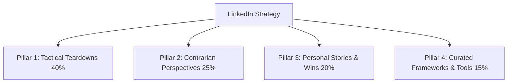

# LinkedIn Content Strategy Playbook

A battle-tested framework for building personal authority, driving inbound pipeline, and scaling engagement using the **Taplio Automation Engine**.

---

## 1. The 4-Pillar Content Engine

To maintain high engagement and avoid sounding monotonous, rotate your posts across 4 distinct pillars:



| Pillar | Focus | Target Outcome | Posting Frequency |
| :--- | :--- | :--- | :--- |
| **Tactical Teardowns (40%)** | Step-by-step actionable guides, workflows, case studies, "how I did X" | Saves, Reposts, High Authority | 2x / week |
| **Contrarian Views (25%)** | Challenging industry dogmas, unpopular truths, mistakes to avoid | High Comment Volume, Debate | 1-2x / week |
| **Personal Stories (20%)** | Behind-the-scenes lessons, founder journeys, vulnerability + key takeaway | Connection, Follower Growth, DMs | 1x / week |
| **Curated Tools/Resources (15%)** | Checklists, AI stacks, template giveaways | Viral reach, Massive Saves | 1x / week |

---

## 2. High-Converting Hook Formulas

The first 2-3 lines before the *"see more"* cut determine 80% of your post's reach.

### Formula 1: The Contrarian Reversal
> *"Most people think [Common Belief]. They're completely wrong.*
> *Here is what actually works in 2026:"*

### Formula 2: The Proof + Timeframe
> *"How we went from [Point A] to [Point B] in [Timeframe].*
> *No [Objection 1], no [Objection 2]. Just this 4-step framework:"*

### Formula 3: The Costly Mistake
> *"I spent 5 years making this mistake so you don't have to.*
> *Here is the #1 reason [Target Audience] fails to [Desired Goal]:"*

### Formula 4: The Curated Cheat Sheet
> *"Stop wasting hours on [Task].*
> *Here are [Number] free tools that will save you 10+ hours this week:"*

---

## 3. High-Engagement Formatting Rules

1. **Short Paragraphs**: 1-2 sentences maximum per paragraph. LinkedIn is mobile-first.
2. **Whitespace**: Generous line breaks. Dense walls of text get scrolled past.
3. **No External Links in Post Body**: Keep outbound links in the comments or your profile bio to preserve algorithmic distribution.
4. **Strong Closing Question (CTA)**:
   - *"What's your biggest challenge with X right now?"*
   - *"Agree or disagree? Drop your thoughts below."*
5. **The 60-Minute Engagement Window**: Spend the first 45-60 minutes after publishing actively replying to every incoming comment to trigger secondary reach waves.

---

## 4. End-to-End Weekly Workflow with Taplio

```
[Monday Morning]
1. Inspiration Scan:
   python taplio_cli.py inspirations "your_niche_topic"
   
2. Draft 5 Posts for the Week:
   Write posts using the 4-Pillar templates.
   
3. Queue into Taplio:
   python taplio_cli.py create-draft "..."
   
4. Schedule optimal slots (e.g. 8:30 AM EST):
   python taplio_cli.py schedule <draft_id> "2026-09-15T12:30:00Z"
   
[Friday Afternoon]
5. Review Metrics & Iterate:
   python taplio_cli.py analytics
```
